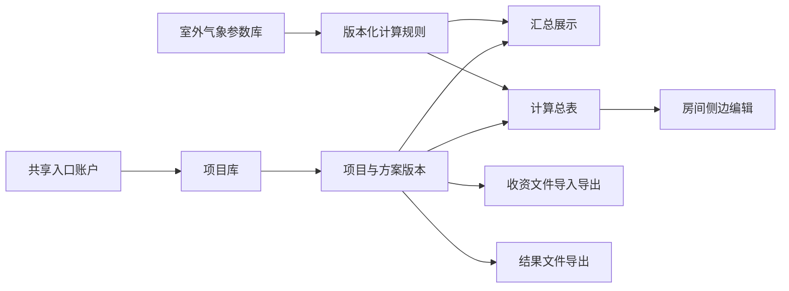

# 洁净区暖通计算工作台实施计划

## 1. 目标形态

建设一个轻量内网计算工作台，以当前暖通 Excel 的参数含义、单位、默认值和有效公式为计算权威，同时重新设计项目、房间、版本、收资和结果展示流程。

V1 的核心价值是：

1. 保存和读取计算方案版本，并支持 Fork。
2. 用按房间录入、复制新建和 Excel 收资替代固定列式操作。
3. 普通界面不展示或允许编辑计算公式。
4. 用项目/楼层汇总和计算总表提供设备选型依据。

## 2. 产品结构

主要页面：

- 登录页：单一共享账户和口令。
- 项目库：项目搜索、新建、从收资文件新建、打开、永久删除。
- 项目工作台：项目级条件、方案版本切换、保存、Fork、删除版本。
- 汇总展示：项目总需求、楼层需求和关键数量表。
- 计算总表：参数为行、房间为列；分组折叠、参数搜索、楼层/区域筛选。
- 房间侧栏：分组编辑房间输入参数，应用后重算当前工作副本。
- Excel 导入确认：新增、覆盖、冲突预览和错误定位。

## 3. 推荐技术结构

采用一个 Python Flask 单体服务：

- Flask：路由、共享入口验证、项目与版本操作。
- Jinja + HTMX：页面和局部刷新。
- 少量原生 JavaScript及本地打包的表格组件：冻结参数列、横向虚拟滚动、分组折叠和筛选。
- SQLite：项目库、方案版本、房间数据、计算结果和编辑锁。
- `openpyxl`：收资文件解析、模板生成和结果文件导出。
- 独立 Python 计算包：纯函数实现计算规则，并按规则版本组织。

不采用微服务、独立 React 工程、独立数据库服务或 Docker。

## 4. 数据模型建议

| 对象 | 核心内容 |
|---|---|
| Project | 项目编号、名称、客户、地址、备注等项目身份信息 |
| SchemeVersion | V1/V2编号、名称、备注、来源版本、城市及室外条件、计算规则版本、保存时间 |
| Room | 隶属于一个方案版本的房间编号、名称、楼层、区域和全部可编辑参数 |
| CalculationResult | 隶属于方案版本房间、按稳定参数编码保存的计算结果和结果状态 |
| CalculationRuleVersion | 不可变规则版本及对应气象参数库版本 |
| EditLock | 方案版本、浏览器会话、最后活动时间 |

方案版本持有项目级计算条件及其房间集合，Fork 时整体复制，确保不同版本互不影响。房间输入和计算结果建议使用稳定的参数编码保存，页面名称、单位和分组由参数目录统一定义。这样可以在不修改大量表结构的情况下补充公式和发布新规则版本。

## 5. 分阶段实施

### 阶段一：参数与公式基线

1. 从权威模板提取完整参数目录。
2. 为每个参数确定稳定编码、名称、单位、分组、数据类型、默认值和输入/结果属性。
3. 建立公式目录：输出参数、依赖参数、公式、取整规则、适用条件和 Excel 来源单元格。
4. 列出断链公式和未定义关系，并逐项闭环。
5. 建立气象参数库及城市字段映射。

交付物：字段目录、公式目录、待补充公式清单、气象数据集。

完成标准：V1 范围不存在未闭环公式。

### 阶段二：交互原型

1. 使用模拟数据制作项目库、汇总展示、计算总表和房间侧栏。
2. 验证 200 个房间时的筛选、横向浏览、冻结列和分组折叠。
3. 验证“房间应用”和“保存方案”的两级交互。
4. 验证复制新建房间、版本切换和 Fork 流程。

交付物：可操作的桌面端网页原型。

完成标准：核心页面和操作顺序经用户确认，允许在该阶段调整交互。

### 阶段三：版本化计算内核

1. 将公式目录实现为不依赖页面和数据库的纯 Python 计算函数。
2. 建立规则版本接口和只读气象参数库。
3. 按 Excel 明确的 `ROUNDUP`、`FLOOR` 等执行取整，其他中间值保留完整精度。
4. 建立系统与 Excel 的黄金对照用例。
5. 覆盖取大值、零值、可选负荷、不同洁净条件和设备数量取整等分支。

交付物：计算包、规则版本、自动化对照测试。

完成标准：相同输入下，所有有效公式的内部值和显示值均通过 Excel 对照验收。

### 阶段四：项目库与方案版本

1. 实现共享入口账户和服务器配置。
2. 实现项目、房间、室外条件和方案版本的 SQLite 持久化。
3. 实现方案保存、读取、继续编辑、Fork和单独删除。
4. 实现项目永久删除确认。
5. 实现编辑锁：单编辑会话、只读访问、30分钟无活动释放。
6. 将方案版本绑定到不可变计算规则版本。

完成标准：项目和方案可完整保存、重开和派生；旧规则结果不会被新规则改变；并发编辑不会静默覆盖。

### 阶段五：收资与结果文件

1. 生成“参数为行、房间为列”的收资文件。
2. 支持全部或选中房间导出。
3. 支持从收资文件新建项目。
4. 支持向已有项目全量覆盖导入房间参数，但不覆盖项目级信息。
5. 实现整批校验、错误定位、导入预览和事务提交。
6. 生成包含项目/楼层汇总和全部房间计算总表的结果文件。

完成标准：任何导入错误均不会改变项目；结果文件不含公式，且值与网页当前方案一致。

### 阶段六：汇总、集成与部署

1. 对可累加指标生成项目和楼层合计。
2. 对非累加参数生成范围或分类分布。
3. 集成气象覆盖标记、标准值恢复和结果文件说明。
4. 完成最新版 Edge、Chrome 和 1366像素以上桌面布局验证。
5. 提供 Linux `systemd` 和 Windows 服务启动、配置及升级说明。

完成标准：Linux和Windows均可原生部署；200房间项目能够完成编辑、计算、汇总及Excel导入导出全流程。

## 6. 首批工作建议

暂不直接写业务页面。第一批工作应当是：

1. 生成字段目录和公式目录。
2. 将表三全部参数标记为输入、默认值、计算结果或待补充公式。
3. 关闭断链公式。
4. 制作计算总表与房间侧栏的交互原型。

完成这四项后，再进入数据库和完整应用开发，可以显著降低返工。

## 7. V1明确不做

- 多人账号、角色、审批和个人审计。
- 实时协同编辑。
- 自动编辑历史和版本差异比较。
- 独立房间结果详情页。
- 设备厂家、型号库和自动选型。
- 工程范围或阈值报警。
- PDF 导出。
- 移动端和平板适配。
- Docker、独立数据库服务和微服务。
- 项目回收站、删除恢复和自动备份。
